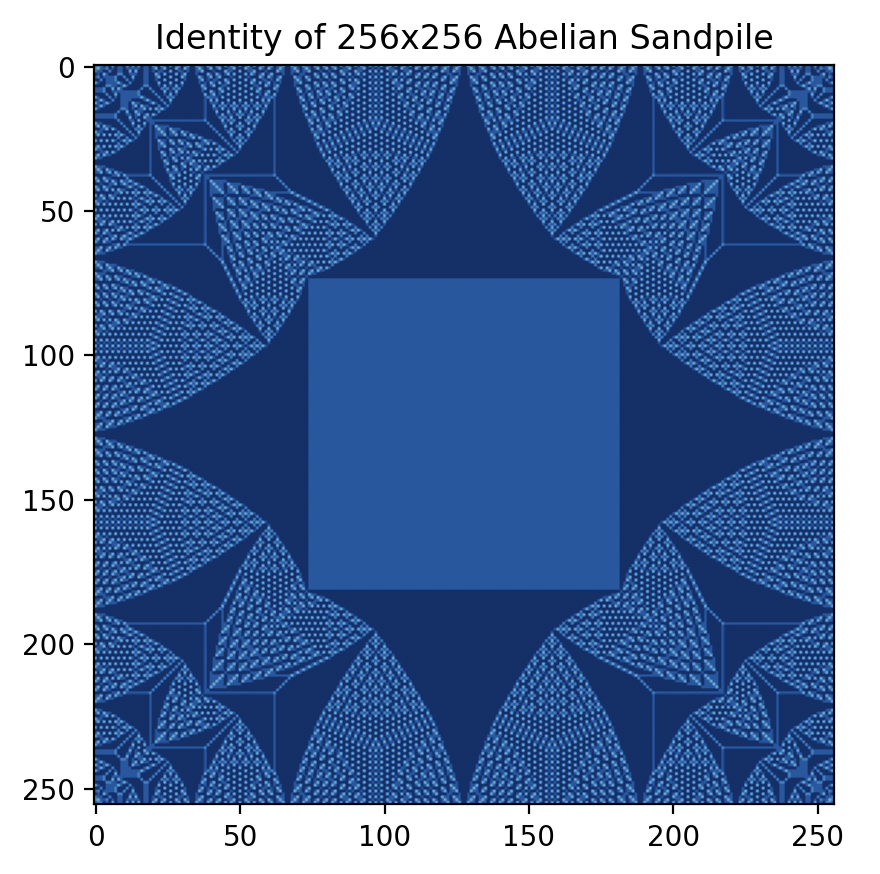

# Abelian Sandpiles

Implementation of abelian sandpiles. Toppling dynamics implemented in "groningen_sand.py" by Noah Doman, from https://fse.studenttheses.ub.rug.nl/21391/1/bMath_2020_DomanN.pdf.

